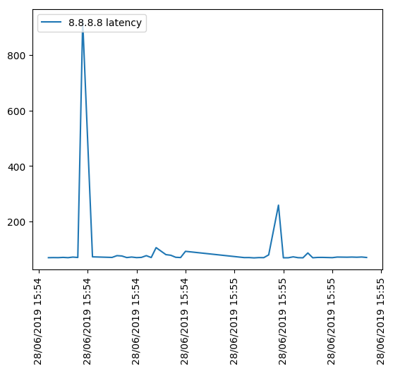

# Convert console logs into plot

Did you ever monitor a process by doing something like that?

```
while :; do
    date;
    MONITORING_COMMAND_THAT_PRODUCES_SOME_NUMBER
done
```

If yes, you know that this simple method lacks some visualisation.
Now you can easily get a plot from that data using this script.

------------------------------------------------------------------

### Simple example: the latency for ICMP request to Google DNS-server:

```
while :; do
    date;
    ping -c1 8.8.8.8 | grep -oP 'time=\K(.+)' | awk '{print $1}'
    sleep 1
done | tee ping.log

Fri Jun 28 19:54:22 +04 2019
69.8
Fri Jun 28 19:54:23 +04 2019
70.1
Fri Jun 28 19:54:24 +04 2019
69.9

...

Ctrl+C
```

Do the trick

```
python log2plot.py --metric='8.8.8.8 latency' < ping.log && xdg-open out.png
```




### Requirements: 

`pip install pandas matplotlib`
